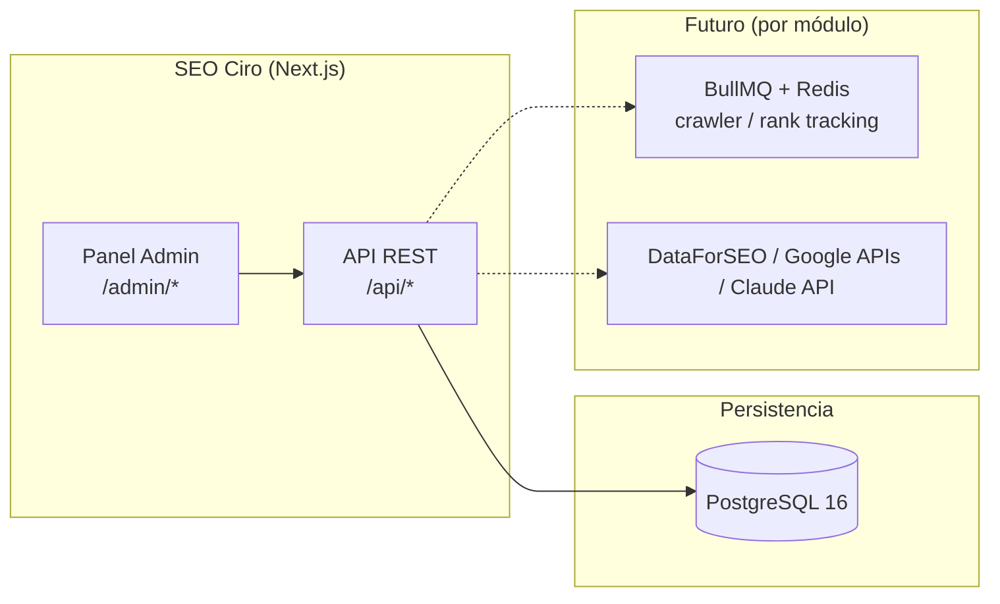

# 02 — Arquitectura

## Visión de alto nivel

SEO Ciro es una aplicación **monolítica Next.js 16** (App Router) que contiene el panel
de administración, la API REST y (en fases futuras) los jobs en segundo plano. Toda la
persistencia vive en una única base **PostgreSQL**. Es una herramienta de un solo
inquilino (la agencia): no hay aislamiento multi-tenant por login como en Cirochat —
los "clientes" son filas `Project`, no cuentas separadas.



## Estructura de carpetas

```
src/
├── middleware.ts          # protege /admin/* excepto /admin/acceso
├── app/
│   ├── admin/
│   │   ├── (auth)/acceso/         # login
│   │   └── (panel)/               # requiere sesión (ver layout.tsx)
│   │       ├── layout.tsx
│   │       ├── page.tsx           # dashboard general
│   │       └── proyectos/         # Módulo 2
│   └── api/
│       ├── auth/[...nextauth]/
│       └── proyectos/
├── components/
│   └── admin/              # AdminShell, AdminSidebar, AdminHeader, ProjectForm
└── lib/
    ├── db/prisma.ts        # cliente Prisma (adapter PrismaPg)
    ├── auth.ts              # NextAuthOptions (credentials + JWT)
    ├── crypto.ts            # AES-256-CBC, listo para secretos futuros
    ├── rate-limit.ts        # limitador de intentos de login
    └── utils.ts
```

## Decisiones de esta fase

- **Sin BullMQ/Redis todavía:** no hay ningún job en background real (crawler, rank
  tracking) construido aún, así que no se monta infraestructura de cola vacía. Se añade
  cuando el Módulo 5, 8 o 9 la necesiten de verdad.
- **Sin tablas de caché/coste de API:** no hay llamadas a DataForSEO/Claude todavía.
  Se añaden junto con el Módulo 1.
- **`lib/crypto.ts` sí está listo** aunque no haya ninguna columna que lo consuma —
  cifrar es barato de tener preparado y el Módulo 6 (tokens OAuth) lo necesitará pronto.

## Relación con Cirochat

Mismo stack y patrones de infraestructura que `../../Cirochat/cirochat-app`
(Next.js, Prisma con adapter `PrismaPg`, NextAuth credentials + JWT, cifrado AES-256-CBC,
Docker multi-stage + Traefik/Coolify). Sin relación de código entre ambos repos —
son proyectos independientes que comparten convenciones.
