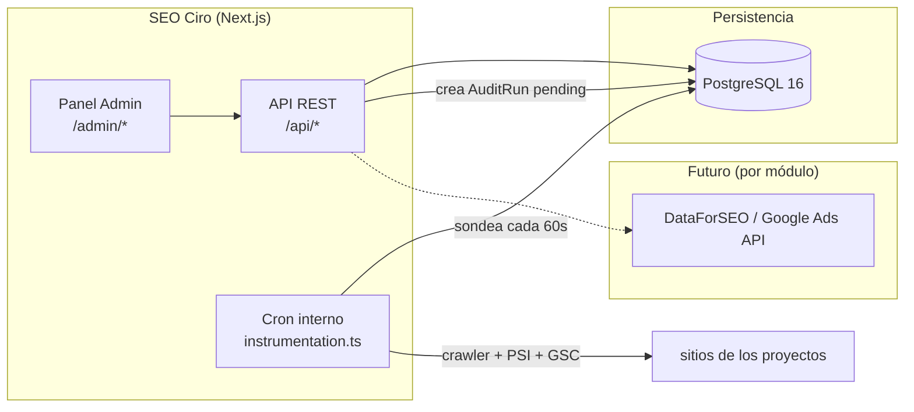

# 02 — Arquitectura

## Visión de alto nivel

SEO Ciro es una aplicación **monolítica Next.js 16** (App Router) que contiene el panel
de administración, la API REST y (en fases futuras) los jobs en segundo plano. Toda la
persistencia vive en una única base **PostgreSQL**. Es una herramienta de un solo
inquilino (la agencia): no hay aislamiento multi-tenant por login como en Cirochat —
los "clientes" son filas `Project`, no cuentas separadas.



## Estructura de carpetas

```
src/
├── middleware.ts          # protege /admin/* excepto /admin/acceso
├── instrumentation.ts     # único fichero que Next.js auto-descubre para el hook
├── instrumentation-node.ts # lógica real del cron (Módulo 8), solo runtime Node
├── app/
│   ├── admin/
│   │   ├── (auth)/acceso/         # login
│   │   └── (panel)/               # requiere sesión (ver layout.tsx)
│   │       ├── layout.tsx
│   │       ├── page.tsx           # dashboard general
│   │       └── proyectos/         # Módulo 2
│   └── api/
│       ├── auth/[...nextauth]/
│       └── proyectos/
├── components/
│   └── admin/              # AdminShell, AdminSidebar, AdminHeader, ProjectForm
└── lib/
    ├── db/prisma.ts        # cliente Prisma (adapter PrismaPg)
    ├── auth.ts              # NextAuthOptions (credentials + JWT)
    ├── crypto.ts            # AES-256-CBC, secretos (refresh token de Google)
    ├── rate-limit.ts        # limitador de intentos de login
    ├── utils.ts
    ├── seo/                 # Módulos 3/4/7: scraping, cliente OpenRouter, log de coste
    ├── google/               # Módulo 6: OAuth2, Search Console, GA4
    ├── keywords/             # Módulo 1: cliente DataForSEO, caché, orquestación, estructura
    └── audit/                # Módulo 8: robots.txt, crawler, PSI, scoring, cron
```

## Decisiones de esta fase

- **Caché de DataForSEO (Módulo 1):** `KeywordDataCache`, clave por (keyword, idioma,
  ubicación), 30 días de frescura, compartida entre proyectos (el volumen es un dato
  objetivo de SERP). El coste de cada llamada real se registra en `ApiUsageLog`
  (`api: "dataforseo"`, dos filas por estudio nuevo: volumen + intención). Un estudio
  100% servido desde caché no genera ninguna fila nueva de coste — la prueba de que el
  caché funciona.
- **Trabajo en segundo plano sin BullMQ/Redis (decisión del Módulo 8):** el spec
  original asume BullMQ+Redis para el crawler, pero se optó por el mismo patrón que
  usa Cirochat para su resumen periódico de conversaciones — un cron interno vía el
  hook de instrumentación de Next.js, sondeando una tabla de Postgres cada 60s. Motivo:
  las auditorías son manuales o como mucho mensuales, no tiempo real; evitar Redis
  significa un servicio menos que desplegar y monitorizar en el VPS de la agencia. El
  Módulo 9 (Geogrid) debe reutilizar este mismo poller, no montar Redis.
  - **Gotcha real encontrado al construirlo:** Next.js solo auto-descubre un fichero
    llamado exactamente `instrumentation.ts` en la raíz de `src/` — el sufijo `-node`
    que usa Cirochat (`src/instrumentation-node.ts`) **no** es una convención que Next
    reconozca por sí sola, es solo el nombre de un módulo pensado para ser importado
    desde el `instrumentation.ts` real. Cirochat **no tiene** ese `instrumentation.ts`
    en ningún sitio del repo — su cron de resumen probablemente nunca se ejecuta en
    producción. SEO Ciro sí tiene el fichero correcto (`src/instrumentation.ts`
    importa condicionalmente `./instrumentation-node` solo cuando
    `process.env.NEXT_RUNTIME === "nodejs"`) — si se toca Cirochat, vale la pena
    verificarlo y arreglarlo igual.
- **`lib/crypto.ts`**: primer consumidor real en el Módulo 6 (refresh token de Google
  cifrado en BD).

## Relación con Cirochat

Mismo stack y patrones de infraestructura que `../../Cirochat/cirochat-app`
(Next.js, Prisma con adapter `PrismaPg`, NextAuth credentials + JWT, cifrado AES-256-CBC,
Docker multi-stage + Traefik/Coolify). Sin relación de código entre ambos repos —
son proyectos independientes que comparten convenciones.
