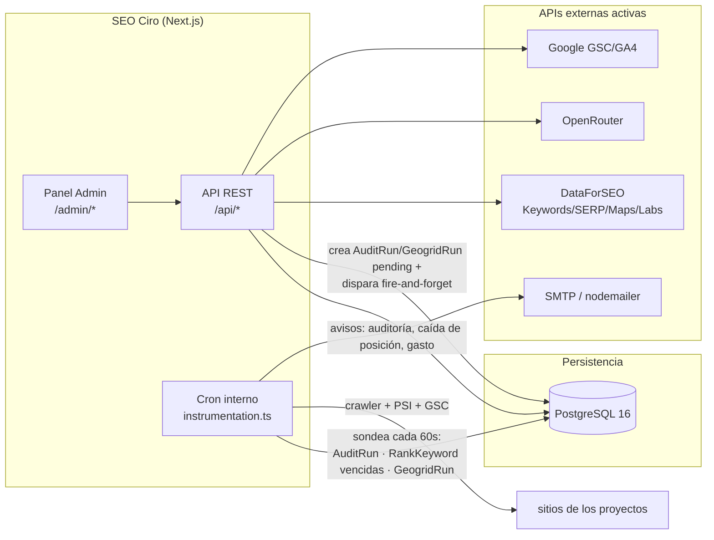

# 02 — Arquitectura

## Visión de alto nivel

SEO Ciro es una aplicación **monolítica Next.js 16** (App Router) que contiene el panel
de administración, la API REST y (en fases futuras) los jobs en segundo plano. Toda la
persistencia vive en una única base **PostgreSQL**. Es una herramienta de un solo
inquilino (la agencia): no hay aislamiento multi-tenant por login como en Cirochat —
los "clientes" son filas `Project`, no cuentas separadas.



## Estructura de carpetas

```
src/
├── middleware.ts          # protege /admin/* excepto /admin/acceso
├── instrumentation.ts     # único fichero que Next.js auto-descubre para el hook
├── instrumentation-node.ts # lógica real del cron (Módulo 8), solo runtime Node
├── app/
│   ├── admin/
│   │   ├── (auth)/acceso/         # login
│   │   └── (panel)/               # requiere sesión (ver layout.tsx)
│   │       ├── layout.tsx
│   │       ├── page.tsx           # dashboard general (KPIs, avisos, salud por proyecto)
│   │       ├── costes/             # panel global de consumo de API (no es tab de proyecto)
│   │       ├── configuracion/      # conexión OAuth2 de agencia con Google (Módulo 6)
│   │       └── proyectos/          # Módulo 2 + resto de módulos anidados por [id]
│   │           └── [id]/
│   │               ├── perfil, tareas, keywords, titulos-meta, schema,
│   │               │   rank, google, contenido, tfidf, auditoria, enlaces,
│   │               │   canibalizaciones, competidores, geogrid, informe, copilot/
│   │               └── (cada carpeta = un módulo; el nav vive en el sidebar
│   │                   global, no en tabs locales — ver "Navegación" abajo)
│   └── api/
│       ├── auth/[...nextauth]/
│       ├── proyectos/
│       └── costes/                 # datos del panel /admin/costes
├── components/
│   └── admin/              # AdminShell, AdminSidebar, AdminHeader, ProjectSwitcher, ProjectForm
└── lib/
    ├── db/prisma.ts        # cliente Prisma (adapter PrismaPg)
    ├── auth.ts              # NextAuthOptions (credentials + JWT)
    ├── crypto.ts            # AES-256-CBC, secretos (refresh token de Google)
    ├── rate-limit.ts        # limitador de intentos de login
    ├── utils.ts
    ├── seo/                 # Módulos 3/4/7: scraping, cliente OpenRouter, log de coste
    ├── google/               # Módulo 6: OAuth2, Search Console, GA4
    ├── keywords/             # Módulo 1: cliente DataForSEO Labs, caché, orquestación, estructura
    ├── rank/                 # Módulo 5: cliente SERP DataForSEO, chequeo, job programado
    ├── geogrid/              # Módulo 9: rejilla de coordenadas, cliente Maps SERP, job
    ├── dataforseo/           # cliente HTTP Basic + tope de gasto (spend.ts), compartido
    │                         # por Módulo 1, 5, 9, TF-IDF y Competidores
    ├── audit/                # Módulo 8: robots.txt, sitemap, crawler, PSI, scoring, cron,
    │                         # generación automática de tareas desde hallazgos
    ├── tfidf/                 # TF-IDF: SERP (vía SerpCache) + scraping + cálculo de términos
    ├── links/                 # PageRank interno sobre AuditRun.linkGraph, huérfanas, hubs
    ├── copilot/                # contexto de proyecto + chat vía OpenRouter (solo lectura)
    ├── competitors/            # DataForSEO Labs: visibilidad de dominio + content gap
    └── notifications/          # avisos por email (nodemailer), dedupe por evento
```

## Navegación

El panel abandonó las pestañas horizontales por proyecto (el antiguo
`ProjectSubNav.tsx` ya no existe en el repo) a favor de un único sidebar global
(`AdminSidebar.tsx`):

- **Nivel global**, siempre visible: Panel general (`/admin`), Proyectos
  (`/admin/proyectos`), Costes (`/admin/costes`), Configuración (`/admin/configuracion`).
- **Nivel de proyecto**: cuando la ruta cae bajo `/admin/proyectos/[id]/...`, aparece
  un segundo bloque bajo un divisor: `ProjectSwitcher.tsx` (combobox con buscador +
  sección "Recientes", últimos 5 vía `localStorage["seoCiro:recentProjects"]`) seguido
  de la lista vertical fija de módulos que devuelve `projectModules()` — Perfil, Tareas,
  Keywords, Título y Meta, Schema, Rank Tracking, Google, Contenido, TF-IDF, Auditoría,
  Enlaces, Canibalizaciones, Competidores, Geogrid (solo si `isLocalBusiness`), Informe,
  Copilot. Cambiar de proyecto desde el switcher preserva el módulo activo cuando existe
  en el proyecto destino (y descarta "geogrid" si el destino no es negocio local).
- El listado de proyectos se pide client-side desde `/api/proyectos` (el sidebar vive en
  el shell de toda la app, no en un layout anidado bajo `[id]`).
- El panel usa ancho completo (`ca28b5f`, `ba7e839`) — solo los formularios "puros"
  (alta/edición de proyecto, configuración) mantienen `max-w-4xl`.

## Decisiones de esta fase

- **Caché de DataForSEO (Módulo 1):** `KeywordDataCache`, clave por (keyword, idioma,
  ubicación), 30 días de frescura, compartida entre proyectos (el volumen es un dato
  objetivo de SERP). El coste de cada llamada real se registra en `ApiUsageLog`
  (`api: "dataforseo"`, dos filas por estudio nuevo: volumen + intención). Un estudio
  100% servido desde caché no genera ninguna fila nueva de coste — la prueba de que el
  caché funciona.
- **Trabajo en segundo plano sin BullMQ/Redis (decisión del Módulo 8):** el spec
  original asume BullMQ+Redis para el crawler, pero se optó por el mismo patrón que
  usa Cirochat para su resumen periódico de conversaciones — un cron interno vía el
  hook de instrumentación de Next.js, sondeando una tabla de Postgres cada 60s. Motivo:
  las auditorías son manuales o como mucho mensuales, no tiempo real; evitar Redis
  significa un servicio menos que desplegar y monitorizar en el VPS de la agencia. Los
  Módulos 5 (Rank Tracking) y 9 (Geogrid) **ya reutilizan** este mismo poller
  (`instrumentation-node.ts` ejecuta `runAuditJob`, `runRankJob` y `runGeogridJob` en
  secuencia cada tick) — no se montó Redis. Las rutas POST de auditoría y geogrid
  además disparan el procesamiento por import dinámico fire-and-forget nada más crear
  el run, para no depender de esperar al siguiente tick en dev/producción.
  - **Gotcha real encontrado al construirlo:** Next.js solo auto-descubre un fichero
    llamado exactamente `instrumentation.ts` en la raíz de `src/` — el sufijo `-node`
    que usa Cirochat (`src/instrumentation-node.ts`) **no** es una convención que Next
    reconozca por sí sola, es solo el nombre de un módulo pensado para ser importado
    desde el `instrumentation.ts` real. Cirochat **no tiene** ese `instrumentation.ts`
    en ningún sitio del repo — su cron de resumen probablemente nunca se ejecuta en
    producción. SEO Ciro sí tiene el fichero correcto (`src/instrumentation.ts`
    importa condicionalmente `./instrumentation-node` solo cuando
    `process.env.NEXT_RUNTIME === "nodejs"`) — si se toca Cirochat, vale la pena
    verificarlo y arreglarlo igual.
- **Tope de gasto (`src/lib/dataforseo/spend.ts`):** `assertWithinSpendLimit(projectId?)`
  se llama antes de cualquier llamada de pago a DataForSEO (rank, geogrid, keyword
  suggestions, TF-IDF, competidores). Compara el gasto del mes en curso (sumado de
  `ApiUsageLog`) contra un tope global (`DATAFORSEO_MONTHLY_LIMIT_USD`) y, si está
  definido, contra `Project.spendLimitUsd`. Supera cualquiera de los dos → lanza y
  bloquea la llamada. Complementa la estimación pre-confirmación (precios verificados
  en `src/lib/dataforseo/pricing.ts`) que ya se muestra en la UI antes de gastar.
- **`SerpCache` (caché cruzada entre módulos):** el top-10 orgánico de cada chequeo de
  Rank Tracking se guarda 7 días; TF-IDF lo reutiliza para no pagar una segunda llamada
  SERP por la misma keyword — relación productor/consumidor de un solo sentido (rank
  produce, TF-IDF consume), no al revés.
- **`lib/crypto.ts`**: primer consumidor real en el Módulo 6 (refresh token de Google
  cifrado en BD).

## Relación con Cirochat

Mismo stack y patrones de infraestructura que `../../Cirochat/cirochat-app`
(Next.js, Prisma con adapter `PrismaPg`, NextAuth credentials + JWT, cifrado AES-256-CBC,
Docker multi-stage + Traefik/Coolify). Sin relación de código entre ambos repos —
son proyectos independientes que comparten convenciones.
